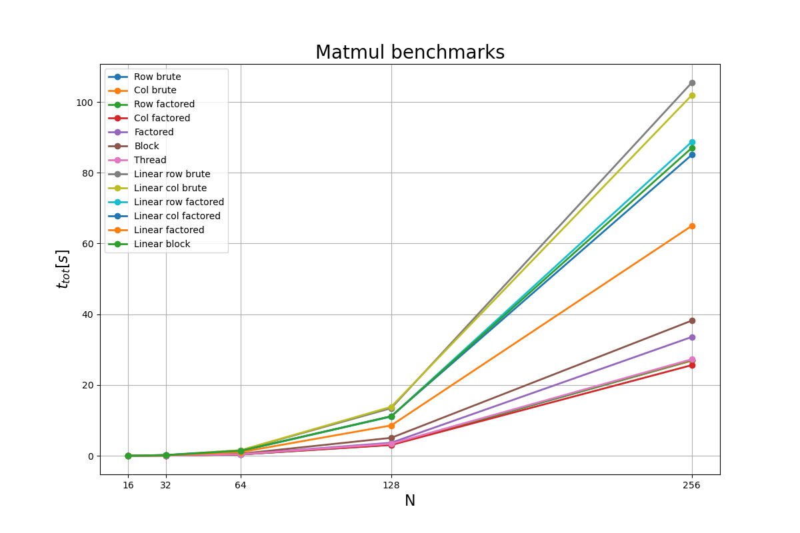
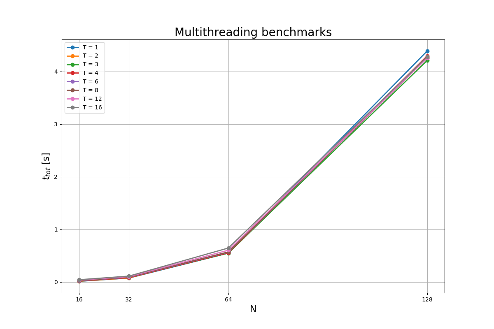
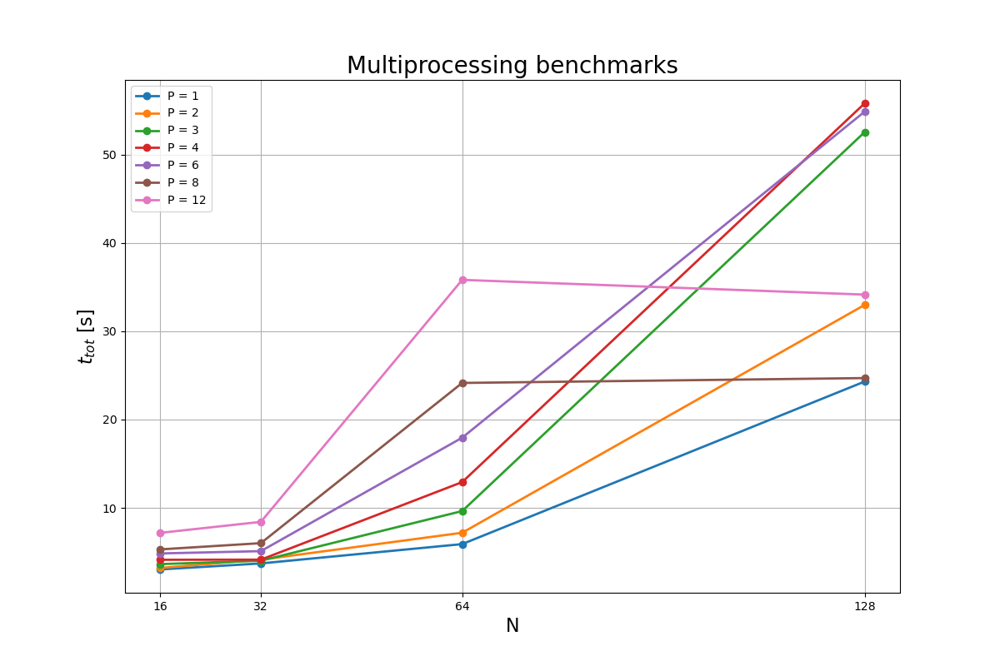

# PyGEMM
PyGEMM - Python General Matrix Multiplication benchmarks

Benchmark of different matrix multiplication methods defined in <code>matmult.py</code>. The matrix multiplication is defined as $C = AB$ where $A,B$ are square matrices of size $(N,N)$.

Matrix multiplication using <code>threading</code> module. Computation time is independant of number of threads which is expected due to Python's global interpreter lock (GIL).

Matrix multiplication using <code>multiprocessing</code> module. Computation time is increasing with increasing number of worker processes meaning overhead time outweighs the gains from parallelization.

